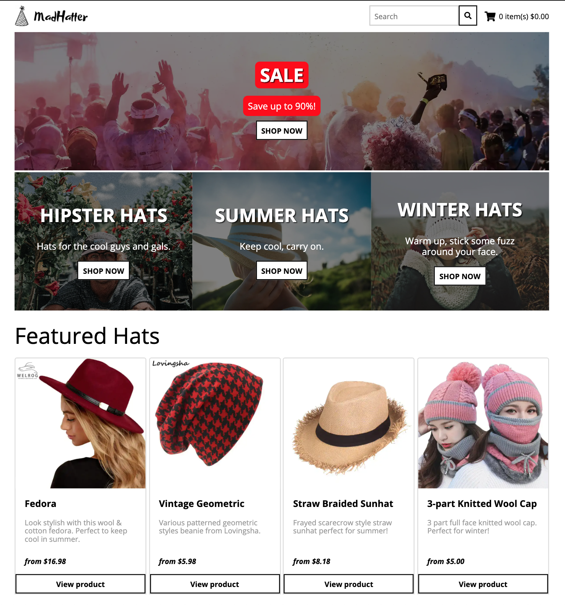

# e-commerce with Gatsby & Shopify

Great tutorial - by Tom Phillips - on how to create an e-commerce store on Shopify, with a Gatsby frontend, hosted on Netlify for easy CI/CD.

Employs build hooks, webhooks, and a clever Netlify cloud function to selectively trigger Gatsby (re)builds, depending on the diff between a Shopify product and its relevant FaunaDB product document.

Uses GraphQL queries to quickly fetch dynamic data from static components. Filter products by (both) selected category and search term - all with sharable shareable URL's.

Handrolled Cart component.

